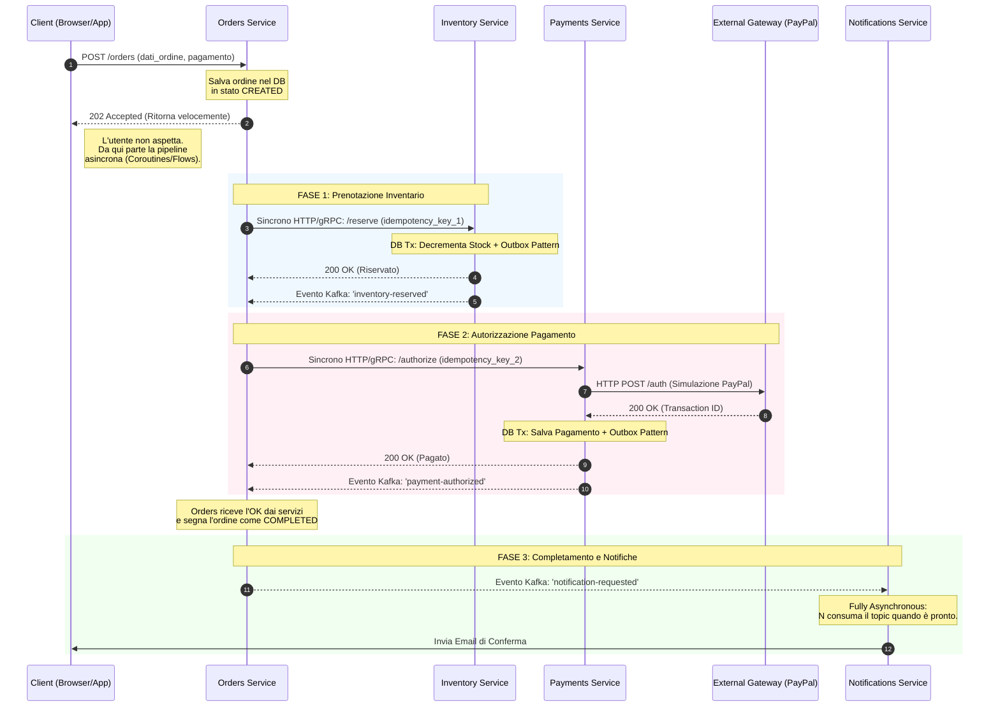

Stessa idempotency key generata dal client e propagata per i servizi downstream e salvata nei DB. 
Implementare meccanismi di retry, backoff esponenziale con jitter.
Outbox pattern per garantire la consistenza tra DB e messaggi Kafka.
Aggiungere circuit breaker e bulkheads. 
In caso di fallimenti implementare strategia di compensazione per correggere la quantità del prodotto. 

